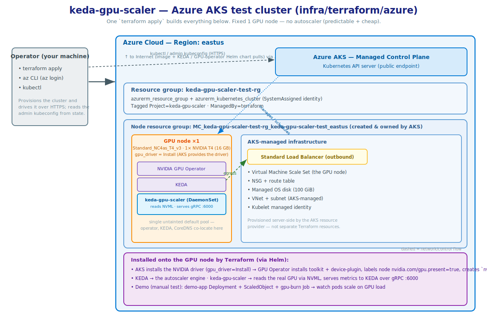
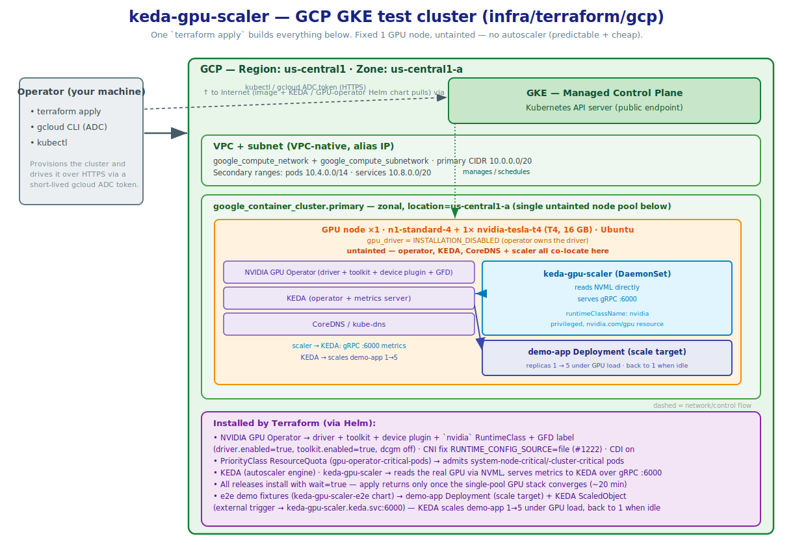

> [!WARNING]
> ## GPU quota and cost — read first, or your apply fails and you may spend a lot of money
>
> GPUs cost ~$1/hr (~$24/day, ~$720/month). Bring the infra up, run the tests,
> destroy everything. Fresh accounts almost always have a GPU quota of **0** —
> request an increase before applying, or the apply fails at node creation:
>
> | Cloud | Quota | Default draw | Verify |
> |---|---|---|---|
> | AWS | "Running On-Demand G and VT instances" (`L-DB2E81BA`), per vCPU/region | `g5.xlarge` = 4 vCPUs | `aws service-quotas get-service-quota --service-code ec2 --quota-code L-DB2E81BA --region us-west-2` |
> | Azure | "Standard NCASv3_T4 Family vCPUs", per region | `Standard_NC4as_T4_v3` = 4 vCPUs | `az vm list-usage --location eastus --query "[?contains(name.value,'NCASv3_T4')]" -o table` |
> | GCP | Global GPU quota + per-region/type (`NVIDIA_T4_GPUS`) | 1 GPU | `gcloud compute regions describe us-central1 --project my-gcp-project --format="table(quotas.filter(metric:'NVIDIA_T4_GPUS'))"` |
>
> Request ≥ the default draw (or more if you bump node count/instance type).
> Approval can take minutes to a couple of days.

# Infrastructure-as-Code for keda-gpu-scaler

Terraform for standing up **throwaway** GPU-ready Kubernetes clusters to
integration-test `keda-gpu-scaler` against real NVIDIA hardware. These are test
clusters, not production infrastructure. AWS (EKS), Azure (AKS), and GCP (GKE)
are implemented today.

## Layout

```
infra/terraform/
  aws/        # Amazon EKS (implemented)
  azure/      # Azure AKS  (implemented)
  gcp/        # Google GKE  (implemented)
```

Each cloud lives in its own self-contained, independently `apply`-able
directory (own providers, modules, variables, state) — no shared root module,
so adding another cloud is a sibling directory, no rework of existing stacks.

The shared contract every directory honours:

- one `terraform apply` produces a cluster immediately ready for integration
  tests (GPU drivers + device plugin, KEDA, `keda-gpu-scaler`, and the e2e demo
  fixtures — a scale target + `ScaledObject` — all installed from in-tree
  charts under `deploy/helm/`);
- the same `*_grpc_endpoint` / `configure_kubectl` style outputs;
- resources tagged/labelled so a forgotten cluster is easy to find and destroy.

## Status

| Target | Directory | Status |
|---|---|---|
| AWS EKS | [`aws/`](./aws) | ✅ Implemented |
| Azure AKS | [`azure/`](./azure) | ✅ Implemented (single GPU node, GPU operator) |
| GCP GKE | [`gcp/`](./gcp) | ✅ Implemented (single GPU node, GPU operator) |

## Conventions

- **Terraform version** pinned per directory via `.terraform-version`
  (currently `1.15.6`); `required_version` floors at the current minor.
- **Providers and community modules are version-pinned**, confirmed against
  the Terraform Registry at authoring time.
- **CI is manual only** — a human runs `terraform apply` locally. Not wired
  into GitHub Actions (a real GPU cluster needs quota and costs money per
  run). The automated counterpart is the Terratest suite — see
  [`tests/terratest/README.md`](../../tests/terratest/README.md).

---

# AWS EKS GPU test cluster

One `terraform apply` provisions everything and leaves nothing manual:

- a small VPC (3 AZs, single NAT gateway),
- an EKS control plane,
- **one** on-demand GPU node (EKS-optimized AL2023 NVIDIA AMI — driver + CUDA +
  container toolkit pre-installed),
- the **NVIDIA GPU operator** (device plugin, GPU-feature-discovery node labels,
  DCGM, and the `nvidia` RuntimeClass),
- **KEDA**, and
- **keda-gpu-scaler**, installed from the in-tree chart at
  `deploy/helm/keda-gpu-scaler` so the cluster always runs the local version.

Uses well-maintained community modules (`terraform-aws-modules/vpc`,
`terraform-aws-modules/eks`) rather than hand-rolled networking/EKS resources.


## Prerequisites

- **Terraform 1.15.6** — pinned in [`aws/.terraform-version`](./aws/.terraform-version)
  (use `tfenv` to match it exactly).
- **awscli v2** on `PATH` with valid credentials for the target account/region.
  The Kubernetes/Helm providers call `aws eks get-token` to authenticate.
- **kubectl** and **helm** (for poking at the cluster after apply; not required
  by Terraform itself).
- The GPU quota above.
- Registry access: `terraform init` fetches the VPC/EKS modules and the
  aws/kubernetes/helm providers from the public Terraform Registry; the apply
  pulls the GPU operator and KEDA charts from `helm.ngc.nvidia.com` and
  `kedacore.github.io`.

## Usage

```bash
cd infra/terraform/aws

cp terraform.tfvars.example terraform.tfvars   # optional: override defaults

terraform init
terraform apply

# Point kubectl at the new cluster (also emitted as the `configure_kubectl` output)
aws eks update-kubeconfig --region us-west-2 --name keda-gpu-scaler-test

# Confirm the GPU is visible and the scaler is running on it
kubectl get nodes -L nvidia.com/gpu.present
kubectl -n keda get pods -o wide
kubectl -n keda get scaledobject
```

The scaler is reachable in-cluster at the `scaler_grpc_endpoint` output, e.g.
`keda-gpu-scaler.keda.svc.cluster.local:6000` — that's the `scalerAddress` a
KEDA `ScaledObject` external trigger should target.

## Common overrides

| Variable | Default | Notes |
|---|---|---|
| `region` | `us-west-2` | Choose one with GPU capacity + your quota. |
| `gpu_instance_type` | `g5.xlarge` (A10G) | Cheaper: `g4dn.xlarge` (T4). Newer: `g6.xlarge` (L4). |
| `gpu_node_count` | `1` | Fixed-size pool (min = max = desired). |
| `kubernetes_version` | `1.33` | EKS control plane version (latest is 1.36; keep to a version in standard support). |
| `gpu_operator_chart_version` | `v26.3.2` | NVIDIA GPU operator chart. |
| `keda_chart_version` | `2.20.1` | KEDA chart. |

```bash
terraform apply -var 'gpu_instance_type=g4dn.xlarge'
```

## Cost & teardown

Rough on-demand list prices (us-west-2, USD; check current pricing for your
region):

| Component | Approx. cost |
|---|---|
| EKS control plane | ~$0.10/hr (~$73/mo) |
| 1x `g5.xlarge` GPU node | ~$1.0/hr (~$24/day) |
| NAT gateway | ~$0.045/hr + data processing |
| EBS (100 GiB gp3) + misc | a few $/day |

Ballpark: **~$1.2/hr (~$28/day)** with the defaults. `g4dn.xlarge` is roughly
half the GPU cost. **Destroy when done:**

```bash
terraform destroy
```

Every resource is tagged `Project=keda-gpu-scaler`, `ManagedBy=terraform`, so
leftovers from an interrupted destroy are easy to find:

```bash
aws resourcegroupstaggingapi get-resources \
  --tag-filters Key=Project,Values=keda-gpu-scaler --region us-west-2
```

## Scaler chart requirements

`keda-gpu-scaler` is a privileged DaemonSet that links `libnvidia-ml.so` at
runtime, so it only starts on a host with working NVIDIA drivers:

| Chart requirement | Provided by |
|---|---|
| `nodeSelector: nvidia.com/gpu.present=true` | GPU-feature-discovery (GPU operator) labels the GPU node |
| `runtimeClassName: nvidia` | GPU operator creates the `nvidia` RuntimeClass; the AL2023 NVIDIA AMI configures the `nvidia` containerd runtime |
| working driver + `libnvidia-ml.so` | pre-installed on the AL2023 NVIDIA AMI |
| `tolerations: nvidia.com/gpu` | no-op here — the single GPU pool is intentionally untainted so KEDA/CoreDNS can co-locate |

If you taint GPU nodes, add a separate CPU node group for KEDA/system pods.

---

# Azure AKS GPU test cluster

Sibling to the AWS stack. One `terraform apply` provisions everything, no
manual steps:

- a resource group,
- an AKS control plane (Free tier — Microsoft-managed API server, no
  control-plane charge),
- **one** on-demand GPU node as the cluster's untainted default pool, created
  with `gpu_driver = "None"` so AKS installs no GPU software,
- the **NVIDIA GPU operator** (host driver, container toolkit, device plugin,
  GPU-feature-discovery labels, DCGM, and the `nvidia` RuntimeClass),
- **KEDA**, and
- **keda-gpu-scaler**, installed from the in-tree chart.

Unlike EKS, AKS manages its own VNet, so there is no networking module — the
native `azurerm_kubernetes_cluster` resource is the whole cluster. Uses the
**native resource, not the community `Azure/aks/azurerm` module**: the module
exposes `gpu_driver` only on *extra* node pools, which would force a 2-pool
(system + GPU) design; native lets the single GPU node be the untainted
default pool — the cheapest layout and a mirror of the EKS single-pool design.



## Pinned versions

| Component | Pin | Notes |
|---|---|---|
| Terraform | `1.15.6` (floor `>= 1.15.0`) | `.terraform-version` |
| azurerm provider | `~> 4.79` | current 4.x |
| kubernetes / helm providers | `~> 3.2` | |
| Kubernetes (AKS) | `1.33` | current in-support minor; 1.34/1.35 also supported |
| GPU VM size | `Standard_NC4as_T4_v3` | 1× NVIDIA T4, 4 vCPUs |
| NVIDIA GPU operator chart | `v26.3.2` | |
| KEDA chart | `2.20.1` | |
| scaler image | `ghcr.io/pmady/keda-gpu-scaler:v0.5.0` | chart `appVersion` has no published image, so pin a real tag |

## Usage

```bash
cd infra/terraform/azure

export ARM_SUBSCRIPTION_ID=<your-subscription-id>
cp terraform.tfvars.example terraform.tfvars   # optional: all vars have defaults

terraform init
terraform apply

# Point kubectl at the new cluster (also emitted as the `configure_kubectl` output)
az aks get-credentials --resource-group keda-gpu-scaler-test-rg \
  --name keda-gpu-scaler-test --overwrite-existing

kubectl get nodes -L nvidia.com/gpu.present
kubectl -n keda get pods -o wide
kubectl -n keda get scaledobject
```

## Common overrides

| Variable | Default | Notes |
|---|---|---|
| `location` | `eastus` | A region with T4 capacity + your quota. |
| `gpu_vm_size` | `Standard_NC4as_T4_v3` (T4) | Bigger: `Standard_NC24ads_A100_v4` (A100), `Standard_NC24ads_L40S_v4` (L40S). |
| `gpu_node_count` | `1` | Fixed-size pool (no autoscaler). |
| `kubernetes_version` | `1.33` | Current in-support minor; 1.34/1.35 also supported. |
| `gpu_operator_chart_version` | `v26.3.2` | NVIDIA GPU operator chart. |
| `keda_chart_version` | `2.20.1` | KEDA chart. |

## Cost & teardown

The AKS control plane is Free-tier ($0); you pay for the GPU VM (~$0.53/hr for
the default T4) plus a managed disk — ballpark **~$0.55/hr (~$14/day)**,
cheaper than EKS (no paid control plane, no NAT gateway). **Destroy when
done:**

```bash
terraform destroy   # removes the resource group and everything in it
# leftovers, if a destroy is ever interrupted:
az resource list --tag Project=keda-gpu-scaler -o table
```

## Scaler chart requirements

| Chart requirement | Provided by |
|---|---|
| `nodeSelector: nvidia.com/gpu.present=true` | GPU-feature-discovery (operator) labels the node |
| `runtimeClassName: nvidia` | operator's container toolkit configures containerd's `nvidia` runtime + creates the RuntimeClass |
| working driver + `libnvidia-ml.so` | operator's driver daemonset (`gpu_driver = "None"` skips AKS's) |
| privileged | the chart's own securityContext |

The GPU node is the untainted default pool, so KEDA, the operator controllers
and CoreDNS all co-locate with the scaler. KEDA installs before the scaler
(`depends_on`) since the scaler chart renders a `ScaledObject`.

---

# GCP GKE GPU test cluster

Sibling to the AWS and Azure stacks. One `terraform apply` provisions
everything, no manual steps:

- a VPC + subnet (native `google_compute_network`/`google_compute_subnetwork`,
  VPC-native/alias-IP),
- a **zonal** GKE control plane (single zone, cheap/predictable),
- **one** untainted Ubuntu GPU node (`n1-standard-4` + 1× T4) that runs the
  whole stack — the GPU operator, KEDA, CoreDNS, and the scaler,
- the **NVIDIA GPU operator** owning the driver + container toolkit
  (`driver.enabled=true`, `toolkit.enabled=true`) — the node sets
  `gpu_driver_version = "INSTALLATION_DISABLED"` and the label
  `gke-no-default-nvidia-gpu-device-plugin=true`, so GKE installs no GPU
  software of its own,
- **KEDA**, **keda-gpu-scaler**, and the **e2e demo fixtures** (a scale-target
  Deployment + `ScaledObject`, from the shared `keda-gpu-scaler-e2e` chart via
  `e2e.tf`) — all from in-tree charts.

This matches the AWS/Azure single-untainted-pool design: GKE only taints a GPU
node when GKE itself manages the GPU, and here it doesn't — the operator
does — so the node stays untainted and everything co-locates on it.



## Pinned versions

| Component | Pin | Notes |
|---|---|---|
| Terraform | `1.15.6` (floor `>= 1.15.0`) | `.terraform-version` |
| google provider | `~> 6.0` | |
| kubernetes / helm providers | `~> 3.2` | |
| Kubernetes (GKE) | `1.33` | no default (required); current in-support minor |
| GPU machine | `n1-standard-4` + `nvidia-tesla-t4` | 1× NVIDIA T4 |
| NVIDIA GPU operator chart | `v26.3.2` | |
| KEDA chart | `2.20.1` | |
| scaler image | `ghcr.io/pmady/keda-gpu-scaler:v0.5.0` | chart `appVersion` has no published image, so pin a real tag |

## Notable implementation details

- **CNI fix (`RUNTIME_CONFIG_SOURCE=file`) — required.** The toolkit rewrites
  `/etc/containerd/config.toml` and would reset GKE's CNI `bin_dir`
  (`/home/kubernetes/bin`) to the empty `/opt/cni/bin`, breaking pod networking
  (NVIDIA/nvidia-container-toolkit#1222). File-mode edits config in place
  instead. CDI is also enabled (`cdi.enabled`/`cdi.default`).
- **PriorityClass ResourceQuota.** GKE gates `system-node-critical`/
  `system-cluster-critical` behind a ResourceQuota; the stack creates the
  `gpu-operator` namespace + a permissive quota (100 pods, scoped to those two
  PriorityClasses) so the operator/NFD pods are admitted.
- **`wait = true` on the releases**, `helm_timeout = 1800`. The single-pool,
  operator-owned-driver stack converges in ~20 min, so `terraform apply`
  returns only once the GPU stack is actually ready — no async race to verify
  by hand.
- **KEDA before the scaler** (`depends_on`).

## Usage

```bash
cd infra/terraform/gcp

cp terraform.tfvars.example terraform.tfvars   # set project_id, region, zone

terraform init
terraform apply

# apply waits ~20 min for the operator to converge, then returns ready (wait=true)
gcloud container clusters get-credentials keda-gpu-scaler-test --zone us-central1-a --project my-gcp-project

kubectl get nodes -L nvidia.com/gpu.present
kubectl -n gpu-operator get pods
kubectl -n keda get pods -o wide
```

The scaler is reachable in-cluster at the `scaler_grpc_endpoint` output, e.g.
`keda-gpu-scaler.keda.svc.cluster.local:6000` — that's the `scalerAddress` a
KEDA `ScaledObject` external trigger should target.

Terraform already installed the e2e fixtures (a `demo-app` Deployment + its
`ScaledObject`, via the `keda-gpu-scaler-e2e` chart). To exercise scaling,
drive the GPU and watch the app scale:

```bash
kubectl apply -f demo/gpu-load.yaml   # gpu-burn Job — pins the T4 for ~150s
kubectl get deploy demo-app -w        # climbs 1 → 5 under load, back to 1 when idle
```

## Common overrides

| Variable | Default | Notes |
|---|---|---|
| `project_id` / `region` / `zone` | *(required)* | GCP project, region (network) and zone (cluster) — pick one with GPU capacity + your quota. |
| `gpu_machine_type` | `n1-standard-4` | GPU node machine type. |
| `gpu_type` | `nvidia-tesla-t4` | Accelerator attached to the GPU node. |
| `kubernetes_version` | *(required)* | e.g. `1.33` — a version currently offered in your zone/release channel. |
| `gpu_operator_chart_version` | `v26.3.2` | NVIDIA GPU operator chart. |
| `keda_chart_version` | `2.20.1` | KEDA chart. |

## Cost & teardown

GCP gives each project one free zonal cluster; beyond that the control plane
is ~$0.10/hr. You pay for the single GPU node (`n1-standard-4` + T4,
~$0.55/hr) plus disks — ballpark **~$0.65/hr (~$16/day)** with the defaults.
**Destroy when done:**

```bash
terraform destroy   # removes the cluster, node pools, VPC, and everything in it
# leftovers, if a destroy is ever interrupted:
gcloud compute instances list --filter="labels.project=keda-gpu-scaler"
```

> [!WARNING]
> **`terraform destroy` can hang with `context deadline exceeded`.** Destroy
> removes the Helm releases *before* the cluster, and the graceful `helm
> uninstall` of the **GPU operator** is slow (CRD + validating webhook +
> operand daemonsets with finalizers; the `gpu-operator` namespace gets stuck
> `Terminating`). If it exceeds the release `timeout` the destroy errors **and
> leaves the billing GPU node running**. `helm_timeout` is set generously so a
> slow-but-completing uninstall finishes; if it still hangs, skip the
> in-cluster uninstall and delete the cluster directly — it takes everything
> on it with it:
>
> ```bash
> terraform state rm \
>   helm_release.keda_gpu_scaler helm_release.keda helm_release.gpu_operator \
>   kubernetes_resource_quota_v1.gpu_operator_critical kubernetes_namespace_v1.gpu_operator
> terraform destroy   # now deletes only the cluster + VPC — no helm uninstall wait
> ```
>
> Then confirm nothing is still billing: `gcloud container clusters list` and
> `gcloud compute instances list`.

## Scaler chart requirements

| Chart requirement | Provided by |
|---|---|
| `nodeSelector: nvidia.com/gpu.present=true` | GPU-feature-discovery (operator) labels the node |
| `runtimeClassName: nvidia` | operator's container toolkit creates the `nvidia` RuntimeClass + configures the `nvidia` containerd runtime in place (CNI fix) |
| working driver + `libnvidia-ml.so` | installed by the NVIDIA GPU operator's driver container |
| privileged + `nvidia.com/gpu` resource | the operator's device plugin advertises the resource (GKE's is disabled via the node label) |

The operator owns the driver, toolkit, device plugin, and NFD/GFD labels on
the single untainted node; only DCGM is disabled.

---

# Automated e2e path & bootstrap

The manual `terraform apply` walkthroughs above have an automated counterpart:
a Terratest suite at [`tests/terratest/`](../../tests/terratest/README.md)
that applies each cloud's stack, asserts KEDA/`keda-gpu-scaler` scale a
workload under real GPU load, then destroys the stack — via
[`.github/workflows/e2e-apply.yaml`](../../.github/workflows/e2e-apply.yaml),
which is **manual and gated, not automatic** (`workflow_dispatch` only,
requiring a `confirm_cost` input and a GitHub Environment approval gate),
because every run bills real GPU hardware, same as running `terraform apply`
by hand.

Each cloud also has a run-once `infra/terraform/<cloud>/bootstrap/` config
(local state) that provisions the **remote Terraform state backend** and the
**GitHub OIDC** deployer role/app/service account the CI workflows use — see
that directory's `README.md` to run it, and
[`tests/terratest/README.md`](../../tests/terratest/README.md) for the full
OIDC walkthrough and the resulting secrets/variables. The main stacks carry a
partial backend block; state is keyed per run
(`e2e/<cloud>/<cluster_name>.tfstate`).
